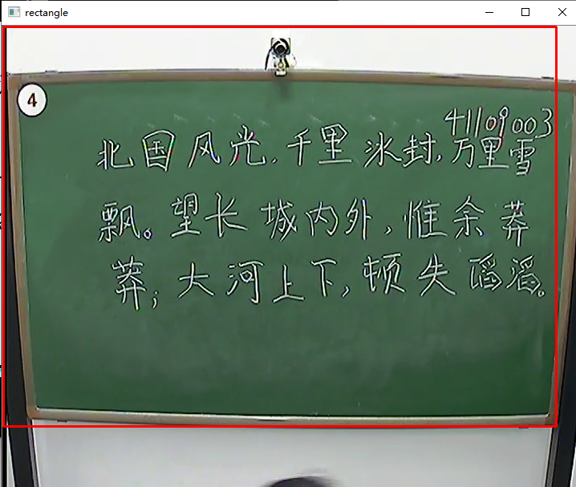
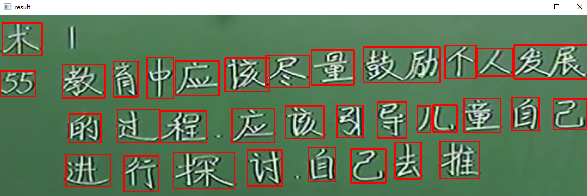

# CharksImagesProcessing
粉笔字图片处理

    Opencv, Python, Tensorflow
    
## 项目介绍

### 代码环境
    python = 3.6  opencv = 4.2
    OS is win10, Code & Run in Pycharm Community
    
### 主要步骤
1. 去除图片中非黑板部分
2. 二值化图片
3. 识别汉字部分
4. 裁剪并补充汉字部分为正方形，并按从左到右、从上到下的顺序编号

### 代码列表
序号    | 描述   | 备注 | 状态
:--------: | :--------: |:--------:| :--------:
0 | [识别黑板字，手写板书分割](opencv-python/Main/CharksImagesProcessing.py) | 主代码文件 | 修改
1 | [黑板裁剪](opencv-python/CodeLab01/黑板裁剪.py) | 裁剪图片,去除图片中非黑板部分| 修改

### 参考
序号    | 描述   | 备注
:--------: | :--------: |:--------:
0 | [点多边形轮廓发现](opencv-python/CodeLab02/点多边形轮廓发现.py) | [来自](https://github.com/JimmyHHua/opencv_tutorials/blob/master/README_CN.md)
1 | [古籍裁剪](opencv-python/CodeLab03/古籍裁剪.py) | [原链接](https://www.cnblogs.com/SaltyFishQF/p/11474482.html?tdsourcetag=s_pctim_aiomsg)
2 | [python3.7官方中文文档](https://docs.python.org/zh-cn/3.7/library) | 
3 | [Canny边缘检测](opencv-python/CodeLab04/canny边缘检测.py) | [来自](https://github.com/JimmyHHua/opencv_tutorials/blob/master/README_CN.md)

### [黑板裁剪](opencv-python/CodeLab01/黑板裁剪.py)
### Method 根据直方图投影裁剪
#### 运行结果

### [识别黑板字，手写板书分割](opencv-python/Main/CharksImagesProcessing.py)
### Method 基于梯度的轮廓发现
#### 函数

`getStructuringElement`函数会返回指定形状和尺寸的结构元素。
这个函数的第一个参数表示内核的形状;
    矩形：MORPH_RECT;
    交叉形：MORPH_CROSS;
    椭圆形：MORPH_ELLIPSE;

**第二和第三个参数分别是内核的尺寸以及锚点的位置。** 一般在调用erode以及dilate函数之前，先定义一个Mat类型的变量来获得getStructuringElement函数的返回值。
对于锚点的位置，有默认值Point（-1,-1），表示锚点位于中心点。

element形状唯一依赖锚点位置，其他情况下，锚点只是影响了形态学运算结果的偏移。

#### 运行结果

### 待改进
黑板裁剪或许使用canny等边缘检测，然后找到面积最大的矩形